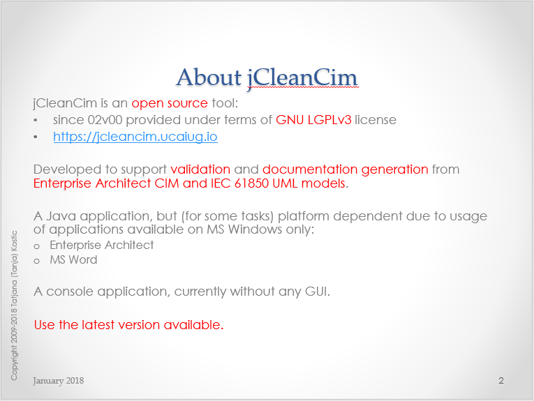

# jCleanCim

  
\[[GitHub Repo](https://github.com/cimug-org/jcleancim)\]

**jCleanCim** is an open source tool for validation and documentation generation from [Enterprise Architect](http://www.sparxsystems.com/products/ea) UML models of IEC TC57 CIM and IEC61850 UML models.

Up until the end of 2015 it had been hosted by the [CIM Methods & Tools for Enterprise Integration group](http://cimug.ucaiug.org/MTEI/Shared%20Documents/jCleanCim) on the CIM Users Group web site, with access limited to the CIM and IEC61850 users community members only. To make it accessible to non-CIMug members, in 2016 it was transitioned to a fully open source tool and hosted at [Tanja's web space](http://www.tanjakostic.org/jcleancim). 

In November of 2022, with Tanja Kostic's approval, jCleanCim was officially migrated here as part of the CIMug's Open Source Initiatives effort.

This is a non-GUI Java application and the Java code is fully platform independent. However, it unfortunately must be run on MS Windows machine due to the usage of Enterprise Architect and MS Word automation libraries (.dlls).

*   [Latest Release](#latest-release)
*   [Introduction to jCleanCim](#inroduction-to-jcleancim)
*   [Documentation](#documentation)
*   [Which distribution should I download?](#which-distribution-should-i-download)
*   [Dependencies](#dependencies)
*   [Performance indicators](#performance-indicators)
*   [Hints - please read carefully before reporting problems!](#hints)
*   [Configuration documentation](#configuration-documentation)
*   [Disclaimer](#disclaimer)
*   [What's new in this release](ReleaseNotes.md#release-notes-for-jcleancim-02v03) 

For a full history of all release notes see [here](ReleaseNotes.md).

## Latest Release

  -   2.3.0

      - The latest release is available on GitHub at [jCleanCim-2.3.0](https://github.com/cimug-org/jCleanCim/releases) and is delivered as a ZIP file.
      - Information on features and fixes for the release can be found in the [release notes](ReleaseNotes.md).

## Introduction to jCleanCim

Check out the "Introduction to jCleanCim" presentation.  It is available in both PDF and PPT formats.

## Documentation
Once you unzip a jCleanCim distribution, `doc` directory contains the full documentation. The important parts of the source code are documented and that documentation is generated as so-called _javadoc_ - namely, a set of web pages that allow for easy navigation.

*   Each distribution contains an up to date set of slides `doc/jCleanCimIntro.pptx` (`doc/jCleanCimIntro.pdf`) - you may want to start from there.
*   Each distribution contains the javadoc in `doc/api/index.html`. The documentation of the root package `org.tanjakostic.jcleancim` (Description section) is a good starting point.
*   Binary distribution contains also the PDF version of that same javadoc, in a file `doc/jCleanCim-[_version_].pdf` (source distribution contains the Apache ant build script to produce this document, so it is not packaged in source distributions).
*   Source distribution contains the PDF version of the depency graph of the Apache ant build targets (this is useful for a developer only).
*   Finally, each distribution contains the test report, run during the build of the distribution, under `doc/testReport/index.html`. For most users this is not really of interest (but keeps our developer spirit in peace :-).

## Which distribution should I download?

jCleanCim is available in two distributions, depending on how you want to use it.

_Even if you have a 64-bit Windows OS,_ ensure you install a 32-bit Java (JRE: runtime) or SDK (software development kit) and have it appear on your PATH before the potentially already installed 64-bit Java, because Enterprise Architect is still a 32-bit application and requires a 32-bit Java. See the commented text in the run.bat script.

| Distribution | User Kind | Prerequisites | Installing |
|------------------|------------------|------------------|------------------|
| Binary distribution jCleanCim-[version]-bin.zip | Run jCleanCim from the console (cmd.exe). | <ul><li>[32-bit Java 7+](http://java.sun.com/javase/downloads/index.jsp) runtime (JRE). To verify whether you already have it installed, open the console window and type `java -version`<li>Enterprise Architect build 834+ (version 7.1+)<li>(optional: to run doc generation) MS Word 2003+</ul> | Unzip the distribution anywhere on your file system; it will uncompress in its own directory tagged with the version so there is no danger of overwriting an older installation. For example, using WinZip, select "Extract to here" command. |
| Source distribution jCleanCim-[version]-bin.zip | Run jCleanCim from the console (cmd.exe) or from within eclipse.  Develop and build it with Apache ant or with eclipse. | <ul><li>[32-bit Java 7+](http://java.sun.com/javase/downloads/index.jsp) software development kit (SDK). To verify whether you already have it installed, open the console window and type `javac -version`<li>Something to compile the code and create executable, e.g.:<ul><li>Apache [ant 1.7.1+](http://archive.apache.org/dist/ant/binaries/apache-ant-1.7.1-bin.zip). To verify whether you already have it installed, open the console window and type `ant -version`.<li>or an IDE if you are already a Java developer.</ul><li>Enterprise Architect build 834+ (version 7.1+)<li>(optional, runtime: to run doc generation) MS Word 2003+<li>(optional, during ant build: to build javadoc with UML for any distribution, and to document ant build targets dependencies graph) [GraphViz application](http://www.graphviz.org/). To verify whether you already have it installed, open the console window and type `dot -version`</ul> | Same as for binary distribution (jCleanCim-[version]-bin.zip).    If used with eclipse, start eclipse SDK and after unzipping, use Import ->Existing project and browse to the unzipped directory.    Note: This is the most flexible option if you are developing, as you can have the eclipse project anywhere on your disk (not necessarily in an eclipse workspace). |

_Note for source distribution (and if you need to create the distribution yourself)_: Ant build file contains targets that invoke GraphViz application for creation of graphical elements for the documentation (UML-enhanced javadoc, and javadoc in pdf format). If you do not have GraphViz installed on your local system, these targets will be just skipped during the build (even if you get exceptions from the doclet, the javadoc gets generated, just without the UML diagrams). However, if you want to produce jCleanCim distributions, you should install GraphViz in order to have nicer documentation.

## Dependencies
To be self-contained, jCleanCim distributions bundle relevant third party open source/distributable libraries. Java jars are in the project's `lib` directory, and MS Windows dlls are in the `dlls` directory.

The following libraries are packaged with all the distributions of jCleanCim:

*   For access to EA model file:
    *   When we need to export images or XMI, we use EA Java API, which in turn depends on a MS Windows dll. By working directly with EA model file, jCleanCim tries to identify problems at the source (.eap file), before any XMI or other artefact generation takes place.
    *   When we don't need to export images or XMI, we use [Jackcess](http://sourceforge.net/projects/jackcess/files/) library that enables light-fast access from Java to MS Access database (EA model file is exactly that), so this is totally OS independent.
*   For document generation functionality, we use [Jacob](http://sourceforge.net/projects/jacob-project/files/) library that enables access from Java to MS Word automation interface, wrapped into a dll for 32bit MS Windows. The MS Word/Office used is the one on your local machine, and not distributed here.
*   For logging, we use Apache's [log4j](http://logging.apache.org/log4j/).
*   For command line processing, we use Apache's [Commons CLI](http://commons.apache.org/cli/).
*   For string markup processing and some stopwatch functionality, we use Apache's [Commons Lang](http://commons.apache.org/lang/).

The following libraries are packaged only with source distribution of jCleanCim:

*   For unit testing, we use [JUnit 4](http://www.junit.org/). You will need this only if you run or develop tests, or if you are producing distributions (that include running tests and producing rest reports).
*   For generation of ant target dependencies graph, we use [Grand](https://ant-grand.github.io/Grand/grand.html) library; it will be ignored if you do not have [GraphViz](http://www.graphviz.org/Download..php) installed. These are not used from the jCleanCim source code.
*   For enhancement of regular javadoc with the UML class diagrams, we use [UmlGraph](http://www.umlgraph.org/) library; it will be ignored if you do not have [GraphViz](http://www.graphviz.org/Download..php) installed. These are not used from the jCleanCim source code.
*   For pdf generation from the javadoc, we use [PDFDoclet](http://sourceforge.net/projects/pdfdoclet/) application. You will need this only if you generate the pdf documentation for binary distribution (from an ant target). The application is otherwise not used from the jCleanCim source code.

Performance indicators
----------------------

Since **jCleanCim** talks to EA and to MS Word through their automation APIs, the model building (as a first step in the application) and the MS Word document generation (if enabled) take time:

*   EA automation API implementation unfortunately does not know of bulk CRUD operation, so for every _single_ item to be returned through the API, they perform an SQL query on the underlying Access RDBMS (even for items in a collection!). Determinant factor for performance here are: number of elements (classes, attributes, ...) and the number of diagrams that need to be saved to file. In release 01v07, we had provided a fully new implementation for reading the UML model from EA (with option `model.useSql = true`, in that release only). **Since release 01v08**, we added one more implementation (see [Fast loading of .eap file](ReleaseNotes.md)) and replaced the `model.useSql` boolean option with the one taking one of three pre-defined string values. **_In short, if you need to export XMI for a model release, or diagrams for document generation, ensure you use `model.builder=sqlxml`, otherwise leave the option empty or set it to `model.builder=db`. See also [hint on fixing ordering errors](#eaErrorOrdering)_** .
*   MS Word is extremely slow at inserting captions for figures, and in particular for tables, as well as in populating and formatting tables. As the number of figures/tables grows, MS Word takes more and more time to insert their captions - similar would happen if you insert captions by hand in an open Word document: higher the number of captions in the document, more time MS Word takes to calculate the number for the caption (and it is impossible to disable this automatic calculation if we want to create tables of figures/tables). **Since release 01v05, we provide a configuration option `docgen.saveReopenEvery` that you should definitely use to speed up MS Word document generation** . Default value is 12, but you should play with your document to find out whether higher value would make it faster. See also [discussion on this option](ReleaseNotes.md) and its resulting performance improvement.

Java processing - for validation, statistics calculation and documentation collection from in-memory model to pass to the actual writer (s), as well as XML document generation for web-access - takes a couple of seconds for all the models and scenarios tested.

## Hints
Here items thay may be considered as issues (but will likely not be addressed soon) and performance-related advice, so please take them into account when running jCleanCim:

*   **If you run only to validate the model or generated XML or Word doc without diagrams, you should use `model.builder=db` as the fastest way; notice that no digrams can ever get exported with this builder.** With any other builder option, and when `docgen.on=true`, diagrams get exported from the EA model (in order to be used in the generated doc), while if `docgen.on=false` (or empty, or absent), document generation is disabled and we know that we don't need diagrams, so they don't get exported at all. Not exporting diagrams saves a lot of time: between 300-500 ms per normative diagram - for 100 normative diagrams, you save at least half a minute to read the model.
*   EA ordering errors. (since 01v08) In the initial, model building phase, you may see logged ERROR (+++ EA ordering error) for several UML elements (diagrams, packages, classes, etc.). This comes from the fact that EA internal storage for some reason does not always keep up to date the order of items in a container. When using API (very slow), we just follow the order of elements as returned by the EA API. However, when processing SQL query results (faster) or reading the tables directly (the fastest),those position indices may be uninitialised (that's how they are stored in the repository). To ensure the order gets preserved, just open the model and manually move an item from the indicated list up and down - this should trigger the EA internal update mechanism - and then you're set as the error should disappear on the next run.
*   If for some reason you're still using `model.builder=japi` for reading from EA file:
    *   Remove any baselines. They grow the size of data in the underlying RDBMS and every SQL query that EA does (unfortunately: 1 for each single attribute/association/class/package/tagged value/constraint/dependency) will take longer on a larger dataset.
    *   Compact EAP file. From within EA, run regularly Tools - Manage .EAP file - Compact .EAP file. There is no effect if this is executed from EA that you've opened with your own model (that is why this is not feasible programmatically either), so you must open EA with an arbitrary, another model (or just launch EA alone), then select your file to compact.
*   When running MS Word document generation:
    *   (since 01v08) If you can, save your template as native Office 2007+ document (.docx), without compatibility enabled. This will run much faster, because in this case only, it is possible to programmatically disable field updates.
    *   This should run correctly only on an English version of MS Office. _Reason_: We create MS Word documents primarily for IEC, and these need to be in English. We have tried hard, but it is literally impossible to have implementation portable among different language versions of MS Word.

        Note that caption labels and styles are notoriously non-portable among installations of MS Word (same user - 2 computers; different users on the same computer; different installation languages). Caption labels are said to be contained in the user's Normal.dotm template, see [here](https://answers.microsoft.com/en-us/office/forum/office_2007-word/new-caption-label-doesnt-display-in-new-version-of/18b9408d-148f-4c76-8d92-917c875406d8), but not really so, see [here](https://www.msofficeforums.com/word/15715-captions-self-defined.html). Additionally, it seems that MS Word sometimes decides and changes things on its own, which affects the global template and/or registry in a way nobody sees it (and every document you'll edit). For example, if you happen to somehow get language for captions changed, see for example [Word is in English but �Figure?, �Equation? and �Table? appear in Spanish](https://superuser.com/questions/55311/microsoft-word-is-in-english-but-figure-equation-and-table-appear-in-span#55326>Microsoft). jCleanCim does NOT want to modify any user-specific installation of MS Word ! You may need to add by yourself into your Word installation what is missing and what you would like to see printed (e.g., caption label in English if you have German MS Word).

        **If somebody finds a portable way without modifying user's registry, please provide the code with test cases and I will integrate into baseline! Until then, if you are running non-English installation of MS Word, ensure you add custom caption labels in English (Figure, Table). If jCleanCim crashes and you are running a non-English installation of MS Word, it is most likely that you forgot to define for-your-language-non-native caption labels Figure and Table.**

    *   Ensure to update all fields in the MS Word template before starting document generation **_with change tracking turned OFF_** , in particular if you have added/removed tables/figures and their captions. MS Word is known to screw up caption numbers (read: identifiers) when you edit them with change tracking enabled.
    *   Disable automatic spell checking in the styles 'PARAGRAPH', 'TABLE-cell' and 'Normal'.
    *   \[old\] On our developer Windows 7 machine, we have noticed that for some special formatting of diagrams (with resizing or such), the process PrintSpooler (the Windows printing service) kicks in immediately after EA repository gets opened. This manifests at building Domain package from the sample EA repository, when it seems like never-ending. When stopping the PrintSpoolerService (Computer/Manage/Services and Applications/Services/PrintSpooler/Stop) at that point, there are about 20 popups from EA process reporting on some font problem (that is how we concluded it is about some interaction of EA with the OS). If this manifests on your machine, the easiest is to temporarily stop PrintSpooler service while running jCleanCim. Note that this has never happened on Windows XP, only on Windows 7.

## Configuration documentation
For an overview of all configuration options, once you have unpacked the release into your local directory, this link to the javadoc documentation should work: [Config](./doc/api/org/tanjakostic/jcleancim/common/config.html). You can access the same page from your installation subdirectory [doc/api/index.html](./doc/api/index.html), by selecting from the class list the class `Config` .

## Disclaimer
Starting with release 02v00, jCleanCim has been licensed under the terms of GNU LGPLv3 [license](license.txt) and includes a modified [copyright](copyright.md). The copyright as well as a reference to the license for this software is available at the download site, and is included in every distribution and in every java source file.

Have a look [here](http://choosealicense.com/licenses/#lgpl-v3) for a relatively accessible comparison of licenses.

* * *

Built on 2019-12-20T22:05:24

[Copyright](copyright.md) [License](license.txt)

[Feedback](mailto:tatjana-dot-kostic-atNoSpam-ieee-dot-org)

