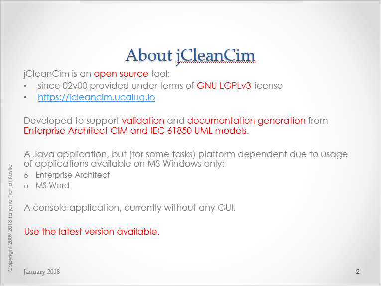

# jCleanCim

  
\[[GitHub Repo](https://github.com/cimug-org/jcleancim)\]

**jCleanCim** is an open source tool for validation and documentation generation from [Enterprise Architect](https://sparxsystems.com/products/ea) UML models of IEC TC57 CIM and IEC61850 UML models.

Up until the end of 2015 it had been hosted by the [CIM Methods & Tools for Enterprise Integration group](https://cimug.ucaiug.org/MTEI/Shared%20Documents/jCleanCim) on the CIM Users Group web site, with access limited to the CIM and IEC61850 users community members only. To make it accessible to non-CIMug members, in 2016 it was transitioned to a fully open source tool and hosted at [Tanja's web space](https://www.tanjakostic.org/jcleancim). 

In November of 2022, with Tanja Kostic's approval, jCleanCim was officially migrated here as part of the CIMug's Open Source Initiatives effort.

This is a non-GUI Java application and the Java code is fully platform independent. However, it unfortunately must be run on an MS Windows machine due to the usage of Enterprise Architect and MS Word automation libraries (.dlls).

*   [Latest Release](#latest-release)
*   [Introduction to jCleanCim](#introduction-to-jcleancim)
*   [Documentation](#documentation)
*   [Distributions and prerequisites](#distributions-and-prerequisites)
    *   [Java runtime requirements](#java-runtime-requirements)
    *   [Binary distribution](#binary-distribution)
    *   [Source distribution](#source-distribution)
*   [Dependencies](#dependencies)
*   [Performance indicators](#performance-indicators)
*   [Hints - please read carefully before reporting problems!](#hints)
*   [Configuration documentation](#configuration-documentation)
*   [Disclaimer](#disclaimer)
*   [What's new in this release](ReleaseNotes.md#release-notes-for-jcleancim-240) 

For a full history of all release notes see [here](ReleaseNotes.md).

## Latest Release

  -   2.4.0

      - The latest release is available on GitHub at [jCleanCim-2.4.0](https://github.com/cimug-org/jCleanCim/releases) and is delivered as a ZIP file.
      - Information on features and fixes for the release can be found in the [release notes](ReleaseNotes.md).

## Introduction to jCleanCim

Check out the "Introduction to jCleanCim" presentation.  It is available in both PDF and PPT formats.

## Documentation
Once you unzip a jCleanCim distribution, the `doc` directory contains the full documentation. The important parts of the source code are documented and that documentation is generated as so-called _javadoc_ - namely, a set of web pages that allow for easy navigation.

*   Each distribution contains an up to date set of slides `doc/jCleanCimIntro.pptx` (`doc/jCleanCimIntro.pdf`) - you may want to start from there.
*   Each distribution contains the javadoc in `doc/api/index.html`. The documentation of the root package `org.tanjakostic.jcleancim` (Description section) is a good starting point.
*   Source distribution contains the PDF version of the dependency graph of the Apache ant build targets (this is useful for a developer only).
*   Finally, each distribution contains the test report, run during the build of the distribution, under `doc/testReport/index.html`. For most users this is not really of interest (but keeps our developer spirit in peace :-).

## Distributions and prerequisites

jCleanCim 2.4.0 ships as two distributions: **binary** and **source**. That is the
only distribution split — there is no separate 32-bit or 64-bit download. Both
require Java 17 or later; which *bitness* of Java you install depends on the
Enterprise Architect project file you are reading.

### Java runtime requirements

Support for Java 17+ was introduced in jCleanCim 2.4.0.

| Your EA project file | Enterprise Architect | Binary distribution needs | Source distribution needs |
|---|---|---|---|
| `.eap(x)` | 15.x and earlier (32-bit) | 32- **or** 64-bit Java 17+ JRE | 32- **or** 64-bit Java 17+ JDK |
| `.qea(x)` | 16.0+ (64-bit) | 64-bit Java 17+ JRE **only** | 64-bit Java 17+ JDK **only** |

**A 64-bit Java installation is recommended.** It generates documentation from both
`.eap(x)` and `.qea(x)` project files, so it is the only choice that works across
every project you are likely to encounter.

> **On 32-bit Java availability.** If you specifically need a 32-bit runtime for the
> legacy `.eap(x)` path, note that most current OpenJDK vendors have wound down 32-bit
> Windows builds: [Eclipse Temurin](https://adoptium.net/temurin/releases) publishes
> x86-32 Windows binaries through JDK 17 but not for JDK 21 or later. This constrains a
> 32-bit installation to the JDK 17 line, which satisfies jCleanCim's Java 17+ floor.
> It is another reason to prefer 64-bit where your EA version allows.

To verify what you already have, open the console window and type `java -version`
(runtime) or `javac -version` (development kit).

### Binary distribution

Archive: `jCleanCim-[version]-bin.zip`

**Intended use.** Run jCleanCim from the console (cmd.exe). For the jCleanCim end-user.

**Prerequisites**

- A **Java 17+ JRE**, at the bitness required by your project file — see
  [Java runtime requirements](#java-runtime-requirements) above.
- [Enterprise Architect](https://sparxsystems.com/products/ea/), at the version
  matching your project file format (see the same table).
- (optional: to run doc generation) [MS Word](https://www.microsoft.com/en-us/microsoft-365/word)

**Installing**

Unzip the distribution anywhere on your file system; it will uncompress into its own
directory tagged with the version, so there is no danger of overwriting an older
installation. Any archive tool will do — right-click the .zip in Windows Explorer and
choose "Extract All", or use the equivalent command in 7-Zip or WinZip.

### Source distribution

Archive: `jCleanCim-[version]-src.zip`

**Intended use.** Run jCleanCim from the console (cmd.exe) or from within Eclipse.
Develop and build it with Apache Ant or with Eclipse. For the jCleanCim developer,
packager, and end-user.

**Prerequisites — required**

- A **Java 17+ JDK**, at the bitness required by your project file — see
  [Java runtime requirements](#java-runtime-requirements) above. A JRE is not
  sufficient: building from source requires a development kit.
- Something to compile the code and create an executable, for example:
  - Apache [Ant](https://ant.apache.org/bindownload.cgi) 1.8.0 or later. To verify whether you already
    have it installed, open the console window and type `ant -version`.
  - or an IDE if you are already a Java developer.
- [Enterprise Architect](https://sparxsystems.com/products/ea/), at the version
  matching your project file format.

If you are already developing in Java with Eclipse, you have what you need. If your
only Eclipse is the runtime bundled with CIMTool, that is **not** sufficient — it is a
runtime without Java code development support. On the Eclipse download site, the
minimum required distribution is "Eclipse IDE for Java Developers"; you can then
install the CIMTool plug-in into that (or a more recent) Eclipse.

**Prerequisites — optional, at runtime**

- (to run doc generation) [MS Word](https://www.microsoft.com/en-us/microsoft-365/word)

**Prerequisites — optional, during the Ant build**

- [Graphviz](https://graphviz.org/download/), used to render the Ant build target
  dependency graph as a PDF for the source distribution. To verify whether you already
  have it installed, open the console window and type `dot -V`. If Graphviz is not
  installed, the target that depends on it is skipped and the rest of the build is
  unaffected; only that one diagram is missing.

Graphviz is the only external install needed for the build. The other build-time
tools — JUnit 4 and Grand — are bundled in the source
distribution's `lib` directory and require no separate download; see
[Dependencies](#dependencies).

**Installing**

Same as for the binary distribution (`jCleanCim-[version]-bin.zip`).

The source distribution contains the Eclipse project files. To use it with Eclipse,
then after unzipping, start Eclipse and use Import -> Existing project and browse to
the unzipped directory.

Note: This is the most flexible option if you are developing, as you can have the
Eclipse project anywhere on your disk (not necessarily in an Eclipse workspace).

_Note for source distribution (and if you need to create the distribution yourself)_: the Ant build file contains a target that invokes the GraphViz application to render the build target dependency graph as a PDF. If you do not have GraphViz installed on your local system, that target is simply skipped during the build. If you want to produce jCleanCim distributions complete with that diagram, install GraphViz.

## Dependencies
To be self-contained, jCleanCim distributions bundle relevant third party open source/distributable libraries. Java jars are in the project's `lib` directory, and MS Windows dlls are in the `dlls` directory.

The following libraries are packaged with all the distributions of jCleanCim:

*   For access to EA model file:
    *   When we need to export images or XMI, we use EA Java API, which in turn depends on a MS Windows dll. By working directly with EA model file, jCleanCim tries to identify problems at the source (the `.eap(x)` or `.qea(x)` project file), before any XMI or other artefact generation takes place.
    *   When we don't need to export images or XMI, we read the EA project file directly as a database, so this is totally OS independent. Which library is used depends on the project file format:
        *   `.eap`/`.eapx` files are MS Access databases, read with the [Jackcess](https://jackcess.sourceforge.io/) library.
        *   `.qea`/`.qeax` files are SQLite databases, read with the [SQLite JDBC driver](https://github.com/xerial/sqlite-jdbc). This was added in release 2.4.0 alongside Jackcess — it does not replace it, since both project file formats remain supported.
*   For document generation functionality, we use [Jacob](https://sourceforge.net/projects/jacob-project/files/) library that enables access from Java to MS Word automation interface, wrapped into a dll for MS Windows. Since release 2.4.0 both 32-bit and 64-bit dlls are distributed, and the matching one is selected for the Java installation you run. The MS Word/Office used is the one on your local machine, and not distributed here.
*   For logging, we use Apache's [log4j](https://logging.apache.org/log4j/).
*   For command line processing, we use Apache's [Commons CLI](https://commons.apache.org/proper/commons-cli/).
*   For string markup processing and some stopwatch functionality, we use Apache's [Commons Lang](https://commons.apache.org/proper/commons-lang/). Both the 2.x and 3.x lines are bundled.
*   Apache [Commons Logging](https://commons.apache.org/proper/commons-logging/) is bundled as a transitive dependency of the libraries above; it is not used directly from the jCleanCim source code.
*   For the logging facade required by the SQLite JDBC driver, we bundle [SLF4J](https://www.slf4j.org/) (API only).
*   For reading and writing OpenXML (`.docx`) documents, we bundle Apache [POI](https://poi.apache.org/) (`poi-ooxml`).

The following libraries are packaged only with source distribution of jCleanCim:

*   For unit testing, we use [JUnit 4](https://junit.org/junit4/). You will need this only if you run or develop tests, or if you are producing distributions (that include running tests and producing test reports).
*   For generation of ant target dependencies graph, we use [Grand](https://ant-grand.github.io/Grand/grand.html) library; it will be ignored if you do not have [GraphViz](https://graphviz.org/download/) installed. These are not used from the jCleanCim source code.
*   For enhancement of regular javadoc with the UML class diagrams, we use [UmlGraph](https://www.spinellis.gr/umlgraph/) library; it will be ignored if you do not have [GraphViz](https://graphviz.org/download/) installed. These are not used from the jCleanCim source code.
*   PDF generation from the javadoc previously used the PDFDoclet application. It was built against the pre-JDK-9 doclet API, which JDK 13 removed, and the project is unmaintained; as of release 2.4.0 the PDF javadoc is no longer produced or distributed.

## Performance indicators

Since **jCleanCim** talks to EA and to MS Word through their automation APIs, the model building (as a first step in the application) and the MS Word document generation (if enabled) take time:

*   EA automation API implementation unfortunately does not know of bulk CRUD operation, so for every _single_ item to be returned through the API, they perform an SQL query on the underlying database - MS Access for `.eap(x)`, SQLite for `.qea(x)` (even for items in a collection!). Determinant factor for performance here are: number of elements (classes, attributes, ...) and the number of diagrams that need to be saved to file. In release 1.7.0, we had provided a fully new implementation for reading the UML model from EA (with option `model.useSql = true`, in that release only). **Since release 1.8.0**, we added one more implementation (see [Fast loading of .eap file](ReleaseNotes.md)) and replaced the `model.useSql` boolean option with the one taking one of three pre-defined string values. **_In short, if you need to export XMI for a model release, or diagrams for document generation, ensure you use `model.builder=sqlxml`, otherwise leave the option empty or set it to `model.builder=db`. See also [hint on fixing ordering errors](#hints)_** .
*   MS Word is extremely slow at inserting captions for figures, and in particular for tables, as well as in populating and formatting tables. As the number of figures/tables grows, MS Word takes more and more time to insert their captions - similar would happen if you insert captions by hand in an open Word document: higher the number of captions in the document, more time MS Word takes to calculate the number for the caption (and it is impossible to disable this automatic calculation if we want to create tables of figures/tables). **Since release 1.5.0, we provide a configuration option `docgen.saveReopenEvery` that you should definitely use to speed up MS Word document generation** . Default value is 12, but you should play with your document to find out whether higher value would make it faster. See also [discussion on this option](ReleaseNotes.md) and its resulting performance improvement.

Java processing - for validation, statistics calculation and documentation collection from in-memory model to pass to the actual writer (s), as well as XML document generation for web-access - takes a couple of seconds for all the models and scenarios tested.

## Hints
Here are items that may be considered issues (but will likely not be addressed soon) and performance-related advice, so please take them into account when running jCleanCim:

* **If you run jCleanCim only to validate the model or generate XML or Word documents without diagrams, you should use `model.builder=db` as the fastest way; notice that no diagrams can be exported using this builder.** With any other builder option, and when `docgen.on=true`, diagrams get exported from the EA model (in order to be used in the generated doc), while if `docgen.on=false` (or empty, or absent), document generation is disabled and we know that we don't need diagrams, so they don't get exported at all. Not exporting diagrams saves a lot of time: between 300-500 ms per normative diagram - for 100 normative diagrams, you save at least half a minute to read the model.

* 	EA ordering errors. (since 1.8.0) In the initial, model building phase, you may see logged ERROR (+++ EA ordering error) for several UML elements (diagrams, packages, classes, etc.). This comes from the fact that EA internal storage for some reason does not always keep up to date the order of items in a container. When using API (very slow), we just follow the order of elements as returned by the EA API. However, when processing SQL query results (faster) or reading the tables directly (the fastest),those position indices may be uninitialised (that's how they are stored in the repository). To ensure the order gets preserved, just open the model and manually move an item from the indicated list up and down - this should trigger the EA internal update mechanism - and then you're set as the error should disappear on the next run.

* 	If for some reason you're still using `model.builder=japi` for reading from EA file:
    *   Remove any baselines. They grow the size of data in the underlying RDBMS and every SQL query that EA does (unfortunately: 1 for each single attribute/association/class/package/tagged value/constraint/dependency) will take longer on a larger dataset.
    *   Compact EAP file. From within EA, run regularly Tools - Manage .EAP file - Compact .EAP file. There is no effect if this is executed from EA that you've opened with your own model (that is why this is not feasible programmatically either), so you must open EA with an arbitrary, another model (or just launch EA alone), then select your file to compact.
  
* When running MS Word document generation:
    *   [since 1.8.0] If you can, save your template as native Office 2007+ document (.docx), without compatibility enabled. This will run much faster, because in this case only, it is possible to programmatically disable field updates.
    *   This should run correctly only on an English version of MS Office. _Reason_: We create MS Word documents primarily for IEC, and these need to be in English. We have tried hard, but it is literally impossible to have implementation portable among different language versions of MS Word.
    *   Note that caption labels and styles are notoriously non-portable among installations of MS Word (same user - 2 computers; different users on the same computer; different installation languages). Caption labels are said to be contained in the user's Normal.dotm template, see [here](https://answers.microsoft.com/en-us/office/forum/office_2007-word/new-caption-label-doesnt-display-in-new-version-of/18b9408d-148f-4c76-8d92-917c875406d8), but not really so, see [here](https://www.msofficeforums.com/word/15715-captions-self-defined.html). Additionally, it seems that MS Word sometimes decides and changes things on its own, which affects the global template and/or registry in a way nobody sees it (and every document you'll edit). For example, if you happen to somehow get language for captions changed, see for example [Word is in English but "Figure", "Equation" and "Table" appear in Spanish](https://superuser.com/questions/55311/microsoft-word-is-in-english-but-figure-equation-and-table-appear-in-span#55326). jCleanCim does NOT want to modify any user-specific installation of MS Word ! You may need to add by yourself into your Word installation what is missing and what you would like to see printed (e.g., caption label in English if you have German MS Word).

**If somebody finds a portable way without modifying user's registry, please provide the code with test cases and I will integrate into baseline! Until then, if you are running non-English installation of MS Word, ensure you add custom caption labels in English (Figure, Table). If jCleanCim crashes and you are running a non-English installation of MS Word, it is most likely that you forgot to define for-your-language-non-native caption labels Figure and Table.**

*   Be sure to update all fields in the MS Word template before starting document generation **_with change tracking turned OFF_** , in particular if you have added/removed tables/figures and their captions. MS Word is known to screw up caption numbers (read: identifiers) when you edit them with change tracking enabled.
    *   Disable automatic spell checking in the styles 'PARAGRAPH', 'TABLE-cell' and 'Normal'.
    *   \[old\] On our developer Windows 7 machine, we have noticed that for some special formatting of diagrams (with resizing or such), the process PrintSpooler (the Windows printing service) kicks in immediately after EA repository gets opened. This manifests at building Domain package from the sample EA repository, when it seems like never-ending. When stopping the PrintSpoolerService (Computer/Manage/Services and Applications/Services/PrintSpooler/Stop) at that point, there are about 20 popups from EA process reporting on some font problem (that is how we concluded it is about some interaction of EA with the OS). If this manifests on your machine, the easiest is to temporarily stop PrintSpooler service while running jCleanCim. Note that this has never happened on Windows XP, only on Windows 7.

## Configuration documentation
For an overview of all configuration options, once you have unpacked the release into your local directory, this link to the javadoc documentation should work: [Config](./doc/api/org/tanjakostic/jcleancim/common/Config.html). You can access the same page from your installation subdirectory [doc/api/index.html](./doc/api/index.html), by selecting from the class list the class `Config` .

## Disclaimer
Starting with release 2.0.0, jCleanCim has been licensed under the terms of GNU LGPLv3 [license](LICENSE) and includes a modified [copyright](copyright.md). The copyright as well as a reference to the license for this software is available at the download site, and is included in every distribution and in every java source file.

Have a look [here](https://choosealicense.com/licenses/#lgpl-v3) for a relatively accessible comparison of licenses.

* * *

[Copyright](copyright.md) [License](LICENSE)

[Feedback](https://github.com/cimug-org/jCleanCim/issues)

